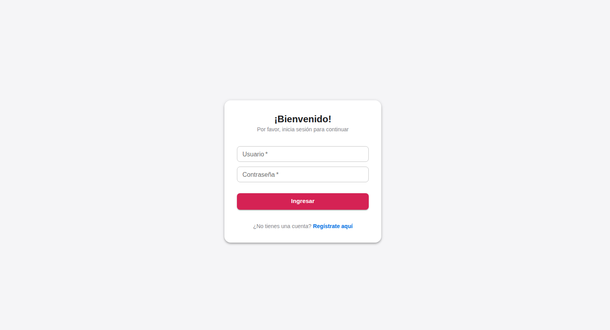
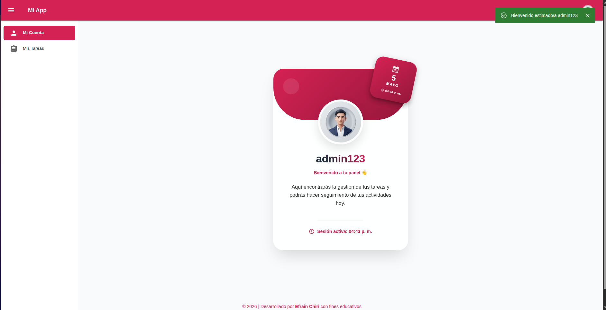
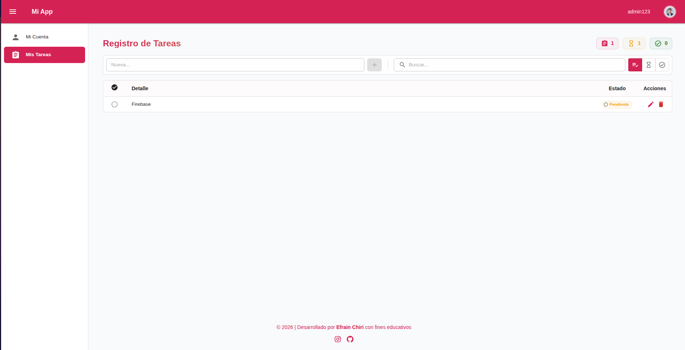

# 🚀 System Tasks - React + TypeScript + Vite

<p align="center">
  
</p>

---

<p align="center">


## ⚡ Demo en vivo

<p align="center">
👉 <a href="https://chirinina.github.io/System-Tasks-add-React/#/login" target="_blank"><b>Abrir Demo del Proyecto</b></a>
</p>

</p>
<p align="center">
  
</p>

<p align="center">
  
</p>

<p align="center">
  
</p>
---


---

## 🚀 Instalación rápida

```bash
git clone https://github.com/chirinina/System-Tasks-add-React.git
cd System-Tasks-add-React
npm install
npm run dev
 